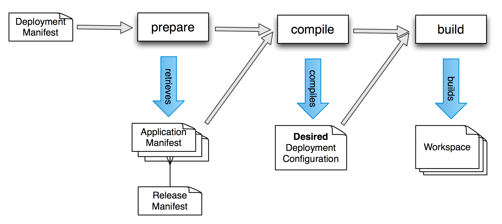

# Compiler
The compiler retrieves and consumes various manifests and compiles them into a deployment configuration. The compilation itself is separated into multiple phases. Each phase can be easily extended via [plugins](compiler_plugins.md).


# Phases
The compile process is structured into three phases that run in series.

## Prepare
In the first phase, all required manifests are retrieved. The source for the release manifest is defined in the deployment manifest, the source for applications can either be configured globally in the release manifest or overwritten on a per-app basis.

The manifests are retrieved using a plugins `getFile` `getFileAs` functions. In the [example](../example/README.md) in this repo,  [compiler-git-no-archive](github.com/push2cloud/compiler-git-no-archive) is used.

The manifests are stored locally on the filesystem in the `__manifests` folder. The structure looks like this:
```
__manifests/__tmp # used during cloning process only
__manifests/deploymentManifest.json
__manifests/releaseManifest.json
__manifests/example # application manifests remain in their path
__manifests/example/apps
__manifests/example/apps/api
__manifests/example/apps/api/package.json
__manifests/example/apps/host
__manifests/example/apps/host/package.json
```

The prepare phase offers additional hooks for your plugins:

  - `afterGetDeploymentManifest` is executed after the deployment manifest has been copied.
  - `afterGetReleaseManifest` is executed after the release manifest has been retrieved.
  - `afterPrepare` is executed after all manifests have been retrieved.

## compile
With all the manifests present, the compiler performs a series of map tasks to put all the pieces of information of the manifests together. It starts with an empty data structure and then proceeds to populate it with:

  - apps (`compiler.js`)
  - utilityApps (`compiler.js`)
  - routes (`mapRoutes.js`)
  - serviceBindings (`mapBindings.js`)
  - envVars (`mapEnvVars.js`)
  - scripts (`mapScripts.js`)
  - services (`mapServices`)

After the basic compilation is done, all configured plugins are invoked with all the manifests and the created deployment configuration.

## build
In this last compiler phase, the local workspace is prepared. This involves the retrieval of all required application sources. The sources are stored locally in the `__workspace` directory. The retrieval is done via a plugins `getSource` function. In the [example](../example/README.md) in this repo,  [compiler-git-no-archive](github.com/push2cloud/compiler-git-no-archive) is used. The structure of `__workspace` looks like this:

```
__workspace
__workspace/by-id
__workspace/by-id/3c1575c5459b375b9d7085035cf5de82
...
__workspace/by-id/3c1575c5459b375b9d7085035cf5de82/example/apps
...
```
The source information (`url`, `referenceValue`) is hashed to avoid the retrieval of the same repository for multiple times.

After the the sources have been retrieved, all `postClone` scripts will be executed at the root of the corresponding repository. This is done via a plugin function `postAction`.
